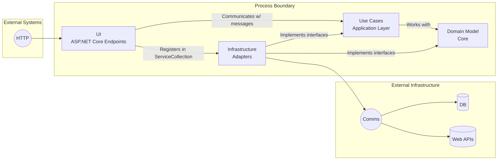
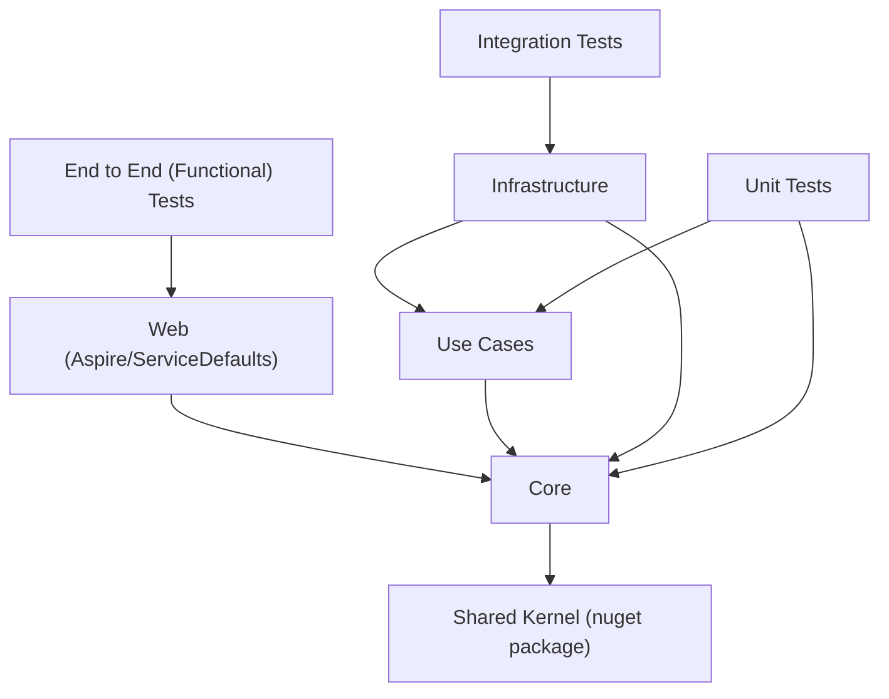

# Keynote
JetBrains dotUltimate 90 days free
- AI coding agent Junie

VSCode extensions:
- [Resharper](https://marketplace.visualstudio.com/items?itemName=JetBrains.resharper-code)
  - Auto commit message. 


### Effortless Distributed Systems With .NET Aspire by Jason Taylor
# Aspire -> Distributed Systems -> Messaging
## .UseChaos()
## Learning Transport
## Messaging Patterns
## Bicep manifest deployment


### 90 days of free access to [Particular Academy](https://particular.net/academy?utm_source=blog&utm_medium=referral&utm_campaign=blog-2025-10-10) - learn more about building distributed systems with NServiceBus and related technologies. Sign up using this link: https://go.particular.net/learn-dsdf


### Clean Architecture With ASP.NET Core by Steve Smith
# Clean Architecture
Extract the infrastructure layer from the domain layer.




### Vertical Slice Architecture (VSA)
Deploy a single feature across layers independently, instead of working on a single layer and delivering nothing.

[ArchUnit.Net](https://github.com/TNG/ArchUnitNET)

```csharp
// Example ArchUnit.Net test to enforce architectural rules
[Fact]
public void DomainTypesShouldNotReferenceInfrastructure()
{
  var domainTypes = Types().That().ResideInNamespace("MyApp.Domain.*").As("Domain types");
  var infrastructureTypes = Types().That()
    .ResideInNamespace("MyApp.Infrastructure.*")
    .As("Infrastructure types");

  var rule = domainTypes.Should().NotDependOnAny(infrastructureTypes);

  rule.Check(Architecture);
}
```
### 'nullable' enable – Unlock the Power of C# Nullability by Maarten Balliauw
# CSharp Nullable Reference Types
Annotations tell more context to compiler about the nullability of your code.

- `var` is always considered `nullable`
- null-coalescing ?? / null-forgiving ! operator should be considered an `antipattern`
- annotations for null static flow analysis:
  - project: `<Nullable>enable</Nullable>`
  - file: `#nullable enable`
  - method: `[return: NotNullIfNotNull("input")]`
  - parameter: `[NotNullWhen(...)] string? input`
  - [MaybeNull] attributes
- JetBrains annotations: `[CanBeNull]`, `[NotNull]`, `[ItemNotNull]`, `[ItemCanBeNull]`
  - [ContractAnnotations("json: null => false; person:null")]
- Generics: `where T : notnull`, [return: MaybeNull]

Annotate your code for dependents.
NullableReferenceTypes are not runtime safety!

### Json deserialization
Use `public required string Name { get; set; }` for required properties instead of `string?`

### Rider inspections:
- Value track -> Inspect -> value origin

### Migrating legacy code to enable NRT:
Small project -> simply enable in project file
Large project -> enable per file with `#nullable enable` annotation and fix warnings gradually.
  - Start from the files with no dependencies.

--- 
### Test-Driven Development With Blazor by Scott Sauber
# TDD with Blazor and bUnit
- xUnit
- Shouldly
  - clearer assertions
- bUnit
  - inject Fake dependnencies
  - queries for the DOM
  - render components
  - helper library

- Don't test CSS
- Don't implementation details
- Avoid using MarkupMatches / .Instance
- Avoid leaking implementation details
- Avoid snapshot tests (like Verify)
- Not testing css classes / attributes existing
- Test behavior, not implementation
- **If I can delete code that breaks your app, but your tests don't. - that's a problem.** 
- **If my tests break but my application don't. - that's also a problem.** 

> "The more your tests resemble the way your software is used, the more confidence they can give you." - Kent C Dodds

> "Remove everything that has no relevance to the story. If you say in the first chapter that there is a rifle hanging on the wall, in the second or third chapter it absolutely must go off. If it's not going to be fired, it shouldn't be hanging there." - Anton Chekhov

> "You won't be good at it if you not doing it."

ChekhovGunRule
- Remove unrelated things from tests

bunit.web.query
- React Testing Library style
  - FindByLabelText


### Building Scalable GenAI Apps Using Semantic Kernel and .NET Aspire by Mehdi Hadeli

App <-> Semantic Kernel <-> AI Models

https://github.com/mehdihadeli/genai-eshop-semantic-kernel

M$ AI Agent Framework vs Semantic Kernel

https://github.com/microsoft/agent-framework


# Everything You (Don’t) Want to Know About Async and Await in C# by Stefan Pölz

Don't consume a ValueTask multiple times.
It may use for other resource.

Runtime-Async in .NET10 - Compiler based async / await.
May no longer have `ValueTask` in .NET11, only `Task` left due to the compiler based Runtime-Async feature. 

Task has these states:
- Cancelled
- Completed
- CompletedSuccessfully

Create cancellationSource with timeout. 
`new CancellationTokenSource(TimeSpan.FromSeconds(5))`

`ThrowIfCancellationRequested()` to throw OperationCancelledException.

isCancellationRequested is a property.
`OperationCanceledException` is thrown when cancellation is requested.

`TaskCancelledException` is thrown when a Task is cancelled.

Async / Await in essence is a state machine storing execution context, then schedule continuations with `SynchronizationContext`.

`ConsoleLifetime` class -> `.ApplicationStopping` cancellation token.

`Task` suitable for caching and reuse.

`ValueTask` best is actually never stored in local variables. Just await it and then forget it.


You can create your own custom Awaiter / Awaitable. Anything that is awaitable must implement [ICriticalNotifyCompletion](https://learn.microsoft.com/en-us/dotnet/api/system.runtime.compilerservices.icriticalnotifycompletion?view=net-9.0)

await is waiting for a type (Task) not waiting for a method. 

`IDisposable` vs `IAsyncDisposable` for async resource cleanup with `await using`.

`await foreach` for async enumerables.

`IEnumerable<T>.WithCancellation(cancellationToken)` to pass cancellation token to async enumerables. With `[EnumeratorCancellation]` attribute for `CancellationToken` method parameter.


The [Progress](https://learn.microsoft.com/en-us/dotnet/api/system.progress-1?view=net-9.0) class and SynchronizationContext in WPF, ThreadPool thread vs Worker thread. 

Refer `OpenSolutionAsync` class to learn how to create your custom progress class.

`Task.Wait()` is synchronize blocking call, no continuation. 
Block the current thread until the Task is completed.
But in UI apps, it may cause deadlocks.

`ConfigureAwait(false)` to avoid deadlocks in UI apps.
continueOnCapturedContext -> the context means SynchronizationContext -> the thread in UI App.
when false, it means don't capture the context, continue in ThreadPool thread instead.

`SynchronizationContext.Current` = main thread in UI apps.

BUT, ASP.NET Core, Console App does not have a SynchronizationContext by default.

Only classic ASP.NET and UI apps (WPF, WinForms) have SynchronizationContext.

Therefore `ConfigureAwait(false)` only relevant in classic ASP.NET and UI apps.


One of the best async/await lesson.

# Does GenAI Mean the Death of Test-Driven Development (TDD) by Johan Smarius
- TDD theory recap
- Demonstrate Rider refactoring features.
- Demonstrate how Prompt files, TDD rules file, and Junie AI coding assistant work to generate tests.
