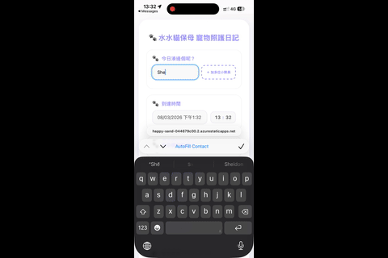

Launched a small tool for my wife over the weekend.

This experience reflects how the modern software engineering process is evolving in the AI era. Traditionally, we would spend a significant amount of time going back and forth with users just to gather requirements and produce an initial prototype.

Instead, my wife described what she wanted in Gemini and quickly generated an initial version. It was buggy and not feature-complete, but it provided a concrete starting point.

From there, I helped refine it—polishing the UX, fixing bugs, and adding features using Codex and the latest GPT-5.4. I then addressed production considerations and deployed it to Azure Static Web Apps.

What used to take a month was compressed into two nights.

I don’t think AI threatens software engineering job security, despite how some marketing materials frame it. Rather, it represents a paradigm shift in how software engineers work and achieve more with less effort.

The future of software engineering lies in using the right AI tools, setting proper guardrails, and maintaining strong accountability.

