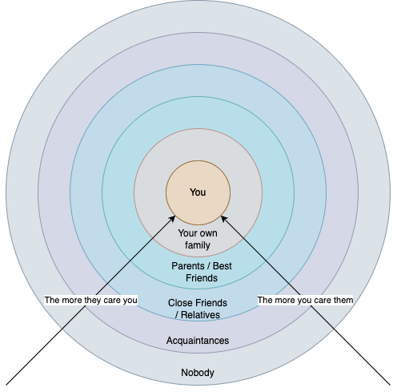

呢個係我人生系統嘅第一部分，講下點樣理解你身邊嘅人。

# 人到中年

有人講笑話過 "The Internet is the worst invention", 呢句笑話係出自 Social Media 嘅興起。

因為 Internet 嘅匿名性，係互聯網普及嘅初期，的確係鼓勵咗社會多咗討論。

呢兩年 GenAI 大熱，出現咗一個關於 Vibe Coding 講法，叫做俾馬騮揸槍。

其實「俾馬騮揸槍」呢樣野，已經係出咗第三次。

第一次係 Social Media 普及嘅時候。
第二次係 Smart Phone 普及嘅時候。
第三次係 GenAI 普及嘅時候。

有網民用 AI Gen 垃圾片 tag 黃仁勳問佢對於個世界使用 AI 嘅方法有咩睇法。

問題係，科技發展遠遠快過人類嘅道德同倫理發展。
個世界越嚟多人係唔知點解有無形嘅惡意，係網上攻擊其他人。
君不見每年有幾多人因為網上欺凌而受到傷害。

而受傷嘅其中一個原因，係因為新一代一出世 Internet，Smart Phone 同 Social Media 就已經係佢哋生活嘅一部分。
所以網上世界對佢哋嚟講自然覺得好重要。

即使自己係一個見證著科技發展嘅人，
我都無可避免受過陌生人嘅網上攻擊。
曾經我都會唔開心，因為 Internet 對於我呢個 A 仔＋ IT人 嚟講係一個好重要嘅地方，老實講我除咗同學同事之外，基本上識嘅人都係網上認識，包括 Elaine。

但自從呢兩年嚟咗英國慢活同睇過 Therapist，
我開始學識點樣去應對。 

我甚至為咗令自己精精神健康，寫咗個 Task 俾 ChatGPT，叫佢幫我 Preview Threads 一次，有咩攻擊性嘅留言自動 Block。
萬一我唔小心睇到，而家我會戰狼上身，討伐形人格上身唔會再畀佢哋影響到我。

但點解要咁做？下面我會講。

# 理解人

1. 大部分係你人生出現嘅人，其實對你嚟講並唔係咁重要。
2. 你並唔需要特登去討好任何人而值得被愛。
3. 傷害你嘅人，係唔可能真係關心你，所以你唔需要理佢哋。
4. 人際關係係雙向而且係需要分階層，越關心你嘅人，你同時應該要對等咁關心返佢哋。
5. 如果傷害你嘅人只係 Nobody，唔好俾所謂嘅道德枷鎖影響到你，正確反擊以保護自己。
6. 嗰啲肆意傷害其他人嘅人，佢哋 Deserve 過得唔好，唔需要同情佢哋。就等佢哋活喺同類嘅回音壁地獄度痛苦到永遠。
7. 唔係叫你主動去傷害其他人，而係叫你好好保護自己，唔好畀啲 Nobody 網絡遊魂傷害到你。

