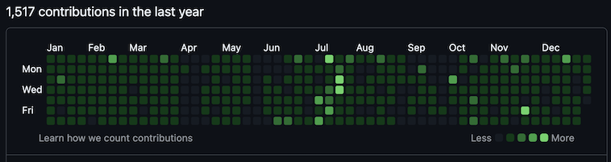
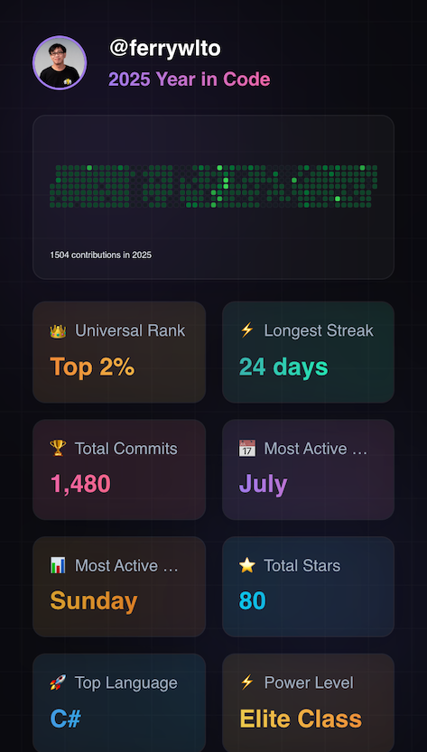
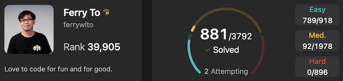
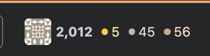
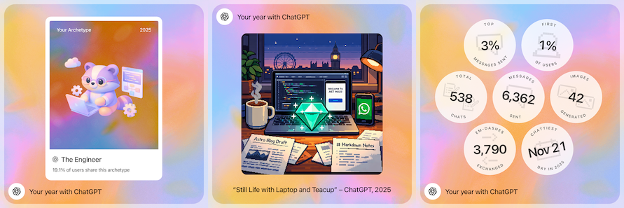

# 2025 年回顧

如果 2024 年係迷失之年，咁 2025 年會係我重拾自信之年。

全年都係度認識自己，計畫人生，返咗次香港探媽媽過生日同母親節。

2025 年下半年本來定的 8 個目標，有兩個取消，有四個半＋半個完成，即六個入面都完成到五個。算唔錯了。

## 伴侶

### 遊歷
- 今年同 Elaine 去咗
  - Buckinghamshire - Stowe Garden, Bicester outlet 食漁匠屋, Woburn Abbey Deer Park
  - Wales - Llandudno
  - Scotland - Gretna Green
  - Warrington - 日嚐食堂
  - Birmingham - 吉百利朱古力工廠、重返 China Town 食港味同 Indoor Market、仲去咗睇《尋秦記》 
  - London - Wembley IKEA、Wembley Arena 睇 YOASOBI 演唱會、Camden Town GundamBase、Regent Park、食風林火山車仔麵
  - MK - 去過兩個香港人市集，喺 Willen Lake 睇煙花玩仙女棒
  - Others - Dunstable Downs
- 有紀錄嘅 deep talk topic 超過 16 個。
- 一齊喺英國戲院睇咗 12 套戲
- 送咗 4 次小禮物

### Love Language
- Appreciation: 87.4%
- Housework: 92.6%
- Hug: 95.6%
- Quality Time: 97.3%
- Say Goodnight: 89% 

## 健康
  - 做到超過 123 次 Ringfit，達成每星期至少三次
  - 開心打咗 66 次乒乓波 🏓
  
## 寫作:
  - 今年寫咗 7 篇文喺 Medium
  - 最開心嘅係有篇諗咗好耐嘅[文](https://ferrywl.to/blogs/2025/12/2025-12-30-the-last-mile-of-quality-why-genai-won-t-replace-professionals/)終於出到 😀

## 事業

### 睇書
  - 睇完 The Company Of One
  - 重睇 The Staff Engineers Path 頭三個 Chapter 

### 小成就
- GitHub
  - Contributed `microsoft/Kiota` repo

- Leetcode: 
  - from 9xxxx to below 40000 (喺最後一日趕到 39905)
  - 881 total questions solved

- Stackoverflow:
  - 5 gold badges
  - 2000 reputations

### Projects:
  - Personal website
  - Company website
  - LoveVet revived
  - Theme color playground
  - Our Time Left prototype
  - WhatsApp API revisit
  - Google Apps Movie Tracker

同場加映：我的ChatGPT 2025年 - Refactor Life into Clean Architecture

# 2026 年展望

2026 年將會係我個人品牌強化之年，主力進修同開發小型產品。

準備好喺 2027 年一係轉高人工嘅工，一係可以重新開始過渡去打自己工。

希望有少少錢可以同 Elaine 返一次香港。

- **H1**
  - Launch OTL
  - LoveVet 完成 Migration
  - 考Azure Fundamental
  - 考Azure AI Introduction
  - 考Az204 Azure Developer
  - 做一個無聊小App - Blokus Tracker

- **H2**
  - 考 Az305 Azure Solution Architect
  - 考 Life in the UK
  - Verified WhatsApp BSP
  - Launch WhatsApp Sorted

- **全年**
  - 執執自己同公司網站嘅 SEO
  - 自己網站加返啲 projects
  - 希望每個月出到一篇文
  - Leetcode 35000 / 200 Medium in total / 1000Q in total.
  - 睇到一到兩本書 (Tidy First / The Phoenix Story) 

